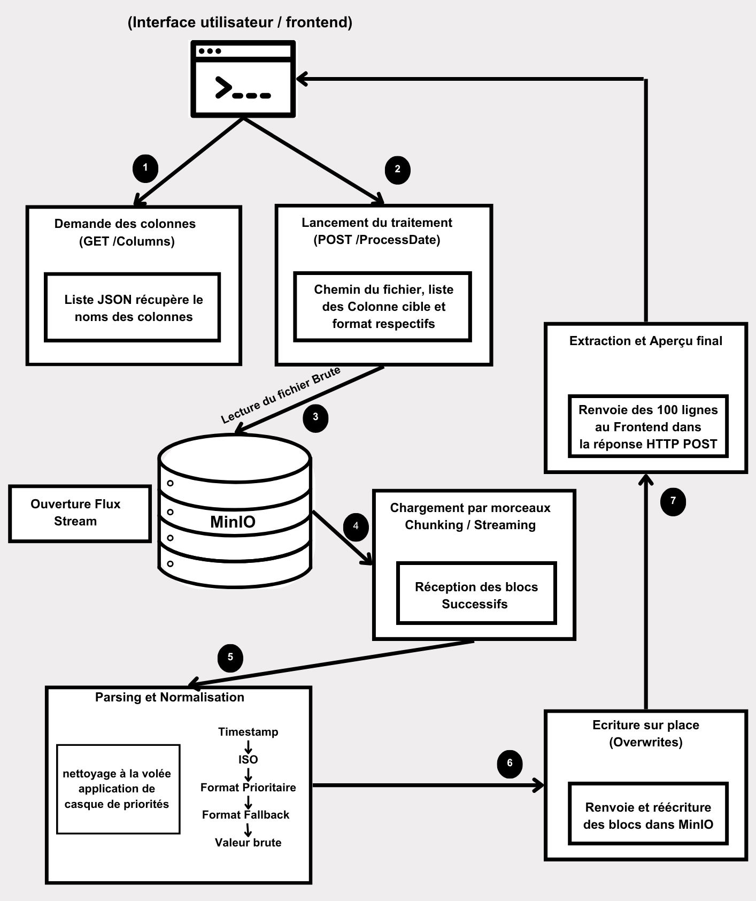

# Spécifications de Conception Technique - Projet ARTECI

## 1. Reformulation du Problème
L'application interne ARTECI traite des volumes importants de données textuelles (fichiers logs, CSV, Excel). L'étape critique de validation des données subit un fort ralentissement (goulot d'étranglement) à cause de l'hétérogénéité des formats de date. Les fichiers volumineux contiennent des colonnes de dates non standardisées, où coexistent parfois des formats français (DMY) et anglais (MDY) au sein d'une même colonne. 

L'enjeu est de construire une API hautement performante, scalable et cloud-native. Elle doit centraliser et accélérer la normalisation de ces colonnes de dates de façon transparente pour le stockage objet existant.

## 2. Périmètre des Formats de Date Supportés
L'API doit identifier, analyser et convertir de façon unifiée vers le format cible unique : `JJ-MM-AAAA HH:mm:ss`.

Les grandes familles de formats prises en charge incluent :

### Groupe 1 : ISO et timestamps

| Format | Exemple | Remarque |
| :--- | :--- | :--- |
| `yyyy-MM-dd` | 2024-03-22 | Format ISO 8601 de base, non ambigu. |
| `yyyy-MM-dd HH:mm:ss` | 2024-03-22 14:30:00 | ISO avec heure, le plus courant dans les logs. |
| `yyyy-MM-dd'T'HH:mm:ss` | 2024-03-22T14:30:00 | ISO 8601 avec séparateur T (format API/JSON courant). |
| `yyyy-MM-dd'T'HH:mm:ssZ` | 2024-03-22T14:30:00Z | ISO avec timezone UTC. Normaliser en ignorant le fuseau (outputer l'heure telle quelle). |
| `yyyyMMdd` | 20240322 | ISO compact, courant dans les noms de fichiers et logs. |
| Timestamp Unix (entier) | 1711108200 | Secondes depuis epoch. Si > 1e10 : interpréter en millisecondes. |

### Groupe 2 : Formats français (DMY)
| Format | Exemple | Remarque |
| :--- | :--- | :---|
| `dd/MM/yyyy` | 22/03/2024 | Format français standard, séparateur /. |
| `dd-MM-yyyy` | 22-03-2024 | Même format avec tiret. Ambigu si jour <= 12 : se fier à l'indication DMY.|
| `dd.MM.yyyy` | 22.03.2024 | Variante avec point, courante en Europe continentale. |
| `d/M/yyyy` | 2/3/2024 | Sans zéro de padding. Ambigu : se fier à DMY. |
| `dd/MM/yyyy HH:mm:ss` | 22/03/2024 14:30:00 | Format français avec heure.|
| `d MMM yyyy (fr)` | 22 mars 2024 | Nom de mois en français. Non ambigu (le mois est textuel). Gérer les accents (janvier, février...). |

### Groupe 3 : Formats anglo-saxons (MDY)

| Format | Exemple | Remarque |
| :--- | :--- | :--- |
| `MM/dd/yyyy` | 03/22/2024 | Format US standard. Ambigu si jour <= 12 : se fier à MDY. |
| `MM-dd-yyyy` | 03-22-2024 | Variante avec tiret. Ambigu : se fier à MDY. |
| `M/d/yyyy` | 3/2/2024 | Sans padding. Hautement ambigu : TOUJOURS se fier à l'indication utilisateur. |
| `MMM d, yyyy (en)` | Mar 22, 2024 | Nom de mois abrégé en anglais. Non ambigu. |
| `MMMM d, yyyy (en)` | March 22, 2024 | Nom de mois complet en anglais. Non ambigu. |
| `MM/dd/yyyy h:mm:ss a` | 03/22/2024 2:30:00 PM | Format US avec heure AM/PM. Convertir en 24h pour la sortie normalisée. |

*Note métier :* Toute cellule mal formatée ou corrompue ne bloque pas le traitement ; la valeur est renvoyée brute en l'état.

## 3. Contrat d'Interface des Endpoints

### Endpoint 1 : Récupération des colonnes
*   **Route :** `GET /columns`
*   **Description :** Liste toutes les colonnes présentes dans un fichier brut cible stocké sur MinIO.
*   **Paramètres d'Entrée (Query Params) :**
    *   `bucket` (string) : Nom du compartiment de stockage.
    *   `file` (string) : Chemin d'accès complet du fichier.
*   **Format de Sortie (JSON) :**
    ```json
    {
      "columns": ["id", "username", "created_at", "updated_date", "country"]
    }
    ```

### Endpoint 2 : Normalisation des dates
*   **Route :** `POST /processDate`
*   **Description :** Standardise les colonnes sélectionnées "en place" dans MinIO et retourne un aperçu.
*   **Corps de la Requête (JSON) :**
    ```json
    {
      "bucket": "raw-data-bucket",
      "file": "path/to/list_of_users_anon_1.csv",
      "date_columns": ["created_at", "updated_date"],
      "date_formats": ["DMY", "MDY"]
    }
    ```
*   **Format de Sortie (JSON) :** Liste JSON contenant exactement les 100 premières lignes du fichier entièrement transformé.

## 4. Schéma du Flux de Données

Le flux suit une architecture découplée où l'API manipule directement le stockage (MinIO) :

